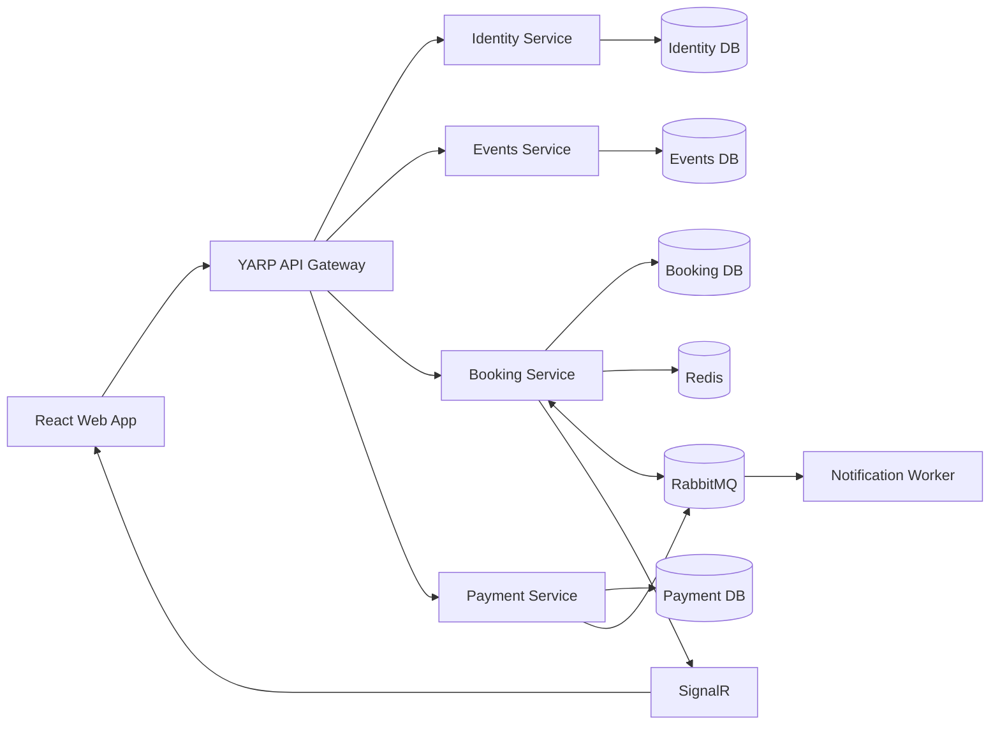

# FlashSeat

FlashSeat is a full-stack event ticketing demo built with a microservice architecture. Users can browse events, select seats, hold them for five minutes, complete a simulated payment, and view their tickets. Administrators can create, publish, and cancel events.

The booking flow uses Redis and PostgreSQL transactions to prevent multiple customers from holding or booking the same seat concurrently.

## Architecture



### Services

| Service | Responsibility |
|---|---|
| Web | React user and administrator interface |
| API Gateway | Public API routing, CORS, and rate limiting |
| Identity | Registration, authentication, JWTs, and roles |
| Events | Event information, publishing, venues, and seat definitions |
| Booking | Seat availability, holds, bookings, and concurrency control |
| Payment | Simulated payments and idempotent payment requests |
| Notification Worker | Processes booking notifications asynchronously |

### Technology

- .NET 8 and ASP.NET Core
- React and TypeScript
- PostgreSQL
- Redis
- RabbitMQ and MassTransit
- SignalR
- Docker Compose

## Run Locally

### Requirements

- Docker
- Docker Compose v2

No local .NET, Node.js, PostgreSQL, Redis, or RabbitMQ installation is required.

### 1. Create the environment file

```bash
cp deploy/.env.example deploy/.env
```

The example values are intended for local development only.

### 2. Build and start the application

```bash
docker compose \
  --env-file deploy/.env \
  -f deploy/docker-compose.yml \
  up -d --build
```

### 3. Check service status

```bash
docker compose \
  --env-file deploy/.env \
  -f deploy/docker-compose.yml \
  ps
```

### Local URLs

| Component | URL |
|---|---|
| Web application | http://localhost:5173 |
| API Gateway | http://localhost:5000 |
| RabbitMQ Management | http://localhost:15672 |
| Mailpit | http://localhost:8025 |

### Demo Accounts

| Role | Email | Password |
|---|---|---|
| Customer | `demo@flashseat.dev` | `Demo@123456` |
| Administrator | `admin@flashseat.dev` | `Admin@123456` |

## View Logs

```bash
docker compose \
  --env-file deploy/.env \
  -f deploy/docker-compose.yml \
  logs -f
```

View logs for selected services:

```bash
docker compose \
  --env-file deploy/.env \
  -f deploy/docker-compose.yml \
  logs -f gateway identity-api events-api booking-api payment-api
```

## Stop the Application

Stop and remove the containers while preserving data:

```bash
docker compose \
  --env-file deploy/.env \
  -f deploy/docker-compose.yml \
  down
```

Stop the application and delete all local database, Redis, and RabbitMQ data:

```bash
docker compose \
  --env-file deploy/.env \
  -f deploy/docker-compose.yml \
  down -v
```

> `down -v` permanently deletes local users, events, bookings, and other persisted development data.

## License

[MIT](LICENSE)
