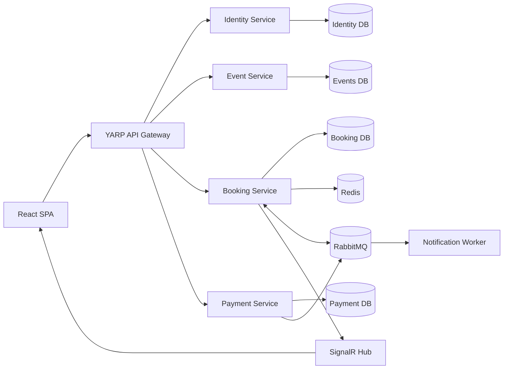
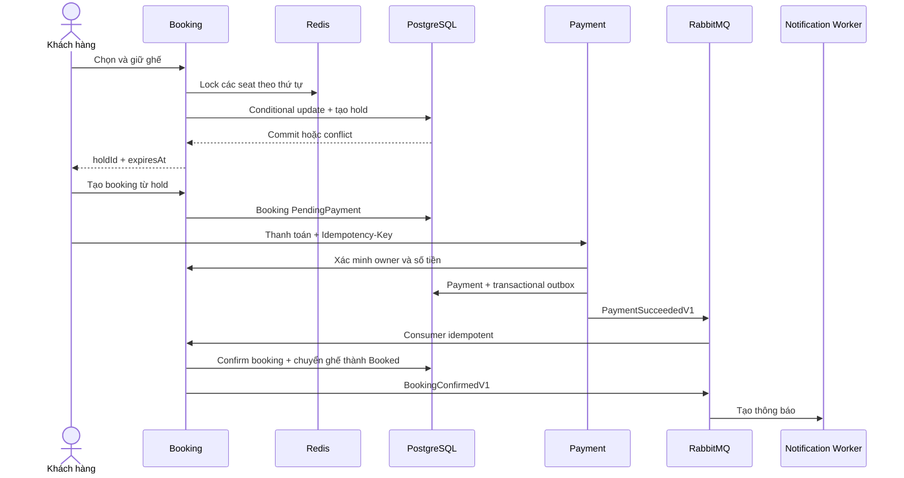

# FlashSeat — Nền tảng đặt vé sự kiện chịu tải cao

FlashSeat là nền tảng đặt vé sự kiện full-stack mô phỏng quy trình bán vé thực tế. Người dùng có thể khám phá sự kiện, chọn ghế, giữ ghế trong 5 phút, tạo đơn, thanh toán giả lập và nhận thông báo xác nhận.

Điểm kỹ thuật chính của dự án: **ngăn hai khách hàng đặt cùng một ghế khi request xảy ra đồng thời** bằng Redis lock kết hợp transaction và conditional update trong PostgreSQL.

> **Trạng thái:** MVP đã được build và kiểm thử local bằng Docker Compose. Tất cả service khởi động healthy; luồng thanh toán thành công/thất bại hoạt động; hai request tranh cùng ghế trả đúng một `201 Created` và một `409 Conflict`.

---

## 1. Tổng quan kỹ thuật

FlashSeat sử dụng kiến trúc microservices để phân tách rõ nghiệp vụ xác thực, quản lý sự kiện, giữ/đặt ghế, thanh toán và thông báo. Hệ thống kết hợp giao tiếp HTTP đồng bộ với integration events bất đồng bộ, đồng thời sử dụng nhiều lớp bảo vệ dữ liệu khi có request cạnh tranh.

Các thành phần kỹ thuật chính:

- ASP.NET Core Web API và C# cho các dịch vụ backend.
- Entity Framework Core và PostgreSQL cho lưu trữ dữ liệu, transaction và optimistic concurrency.
- Redis TTL và distributed lock để điều phối request giữ ghế.
- RabbitMQ, MassTransit, Outbox/Inbox và consumer idempotent cho messaging.
- JWT authentication, refresh token rotation và role-based authorization.
- `async/await`, `BackgroundService`, bounded `Channel<T>` và cancellation cho background processing.
- React, TypeScript strict, TanStack Query, React Hook Form và SignalR cho frontend.
- Docker Compose, health checks, structured logging và GitHub Actions cho vận hành và CI.
- xUnit, Vitest và k6 cho unit test, frontend test và race test.

---

## 2. Tính năng chính

### Khách hàng

- Đăng ký, đăng nhập, refresh token và đăng xuất.
- Xem danh sách, tìm kiếm và xem chi tiết sự kiện.
- Xem sơ đồ ghế cùng trạng thái `Available`, `Held`, `Booked`.
- Chọn tối đa 6 ghế và giữ ghế trong 5 phút.
- Tạo booking từ hold còn hiệu lực.
- Thanh toán giả lập thành công hoặc thất bại.
- Xem lịch sử và trạng thái booking.
- Nhận cập nhật ghế gần realtime qua SignalR.

### Quản trị viên

- Tạo và cập nhật sự kiện nháp.
- Tạo danh sách ghế và giá vé.
- Publish hoặc hủy sự kiện.
- Các API quản trị được bảo vệ bằng role `Admin`.

### Hệ thống

- Tự động giải phóng hold hết hạn.
- Chống double booking bằng nhiều lớp bảo vệ.
- Xử lý message theo cơ chế at-least-once nhưng không tạo side effect trùng.
- Gửi email mô phỏng bằng Notification Worker.
- Cung cấp liveness/readiness health checks.
- Trả lỗi HTTP theo Problem Details.

---

## 3. Kiến trúc tổng thể



### Trách nhiệm từng thành phần

| Thành phần | Trách nhiệm |
|---|---|
| **Gateway** | Điểm truy cập public; route request, CORS, correlation ID, security headers, rate limit |
| **Identity Service** | User, password hash, role, JWT access token, refresh token |
| **Event Service** | Thông tin sự kiện, publish/cancel, sơ đồ ghế tĩnh và giá |
| **Booking Service** | Trạng thái ghế động, hold, booking, chống double booking, SignalR |
| **Payment Service** | Thanh toán giả lập và idempotency key |
| **Notification Worker** | Consume booking event và xử lý email mô phỏng có giới hạn concurrency |

Mỗi service sở hữu database logic riêng. Local development dùng chung một PostgreSQL server nhưng tách thành bốn database:

- `flashseat_identity`
- `flashseat_events`
- `flashseat_booking`
- `flashseat_payment`

Service không truy vấn trực tiếp database của service khác. Payment xác minh booking qua internal HTTP API; các thay đổi trạng thái bất đồng bộ truyền qua immutable integration events.

---

## 4. Luồng đặt vé



### Khi thanh toán thất bại

1. Payment Service phát `PaymentFailedV1`.
2. Booking Service chuyển booking thành `Cancelled`.
3. Ghế được trả về `Available`.
4. Client nhận trạng thái mới từ SignalR hoặc lần refetch kế tiếp.

---

## 5. Cách chống double booking

Redis giúp giảm contention nhưng **PostgreSQL mới là nguồn sự thật cuối cùng**.

Quy trình tạo hold:

1. Validate từ 1 đến 6 seat ID duy nhất.
2. Sắp xếp seat ID để mọi request lock cùng thứ tự.
3. Lock từng ghế trong Redis với token owner riêng và TTL 10 giây.
4. Mở transaction ngắn trong PostgreSQL.
5. Conditional update chỉ nhận ghế `Available` hoặc hold đã hết hạn.
6. So sánh số row được cập nhật với số ghế yêu cầu.
7. Thiếu bất kỳ row nào: rollback toàn bộ và trả `409 Conflict`.
8. Thành công: tạo hold cùng snapshot giá rồi commit.
9. Redis lock chỉ được release nếu token vẫn thuộc request hiện tại.

Kết quả kiểm thử local với hai customer tranh cùng một ghế:

```text
Request 1: 201 Created
Request 2: 409 Conflict
HTTP 500:  0
```

Chi tiết: [docs/concurrency.md](docs/concurrency.md).

---

## 6. Xử lý bất đồng bộ và message

RabbitMQ dùng delivery semantics **at-least-once**, vì vậy message có thể được giao lại.

FlashSeat xử lý bằng:

- Transactional Outbox: database change và message được lưu trong cùng transaction.
- Inbox/unique constraint: consumer không xử lý cùng message hai lần.
- Retry có giới hạn cho lỗi tạm thời.
- Error queue cho message vượt quá retry.
- Correlation ID và Message ID trong structured log.

Notification Worker không tạo raw thread. Worker nhận message rồi ghi command vào bounded `Channel<T>`:

- Capacity mặc định: `500`.
- `FullMode = Wait` để tạo backpressure.
- Số consumer mặc định: `4`.
- I/O mô phỏng dùng async.
- CancellationToken được truyền xuyên suốt.

`Task` không đồng nghĩa với một OS thread. I/O-bound dùng `async/await`; không bọc I/O trong `Task.Run`, không dùng `.Result`, `.Wait()` hoặc `async void` ngoài UI event handler.

---

## 7. Công nghệ sử dụng

### Backend

- .NET 8 LTS, C# và nullable reference types.
- ASP.NET Core Minimal APIs.
- Entity Framework Core và Npgsql.
- PostgreSQL 16.
- Redis 7.
- RabbitMQ 4 và MassTransit.
- YARP API Gateway.
- JWT Bearer Authentication.
- FluentValidation.
- SignalR.
- Serilog và OpenTelemetry instrumentation.
- Swagger/OpenAPI và Problem Details.

### Frontend

- React 18 và TypeScript strict.
- Vite.
- React Router.
- TanStack Query.
- React Hook Form và Zod.
- SignalR JavaScript client.
- Vanilla CSS, responsive, dark-first.
- Vitest và React Testing Library.

### DevOps và kiểm thử

- Docker và Docker Compose.
- GitHub Actions.
- xUnit và FluentAssertions.
- k6 race-test script.

> Dự án dùng .NET 8 LTS vì đặc tả cho phép fallback khi môi trường chưa có .NET 10. Backend vẫn build hoàn toàn trong Docker nên không bắt buộc cài .NET SDK trên máy host.

---

## 8. Cấu trúc thư mục

```text
flashSeat/
├── src/
│   ├── BuildingBlocks/       # Contracts và cross-cutting concerns
│   ├── Gateway/              # YARP API Gateway
│   ├── Services/
│   │   ├── Identity/         # Authentication và user
│   │   ├── Events/           # Event, seat map tĩnh và giá
│   │   ├── Booking/          # Hold, booking và inventory động
│   │   └── Payment/          # Thanh toán giả lập
│   ├── Workers/              # Notification Worker
│   └── Web/                  # React SPA
├── tests/
│   ├── FlashSeat.UnitTests/
│   └── load/
├── deploy/                   # Docker Compose và env example
├── docs/                     # Architecture, API, concurrency, cloud
└── .github/workflows/        # Backend và frontend CI
```

Domain/Application không phụ thuộc Infrastructure. API là composition root. EF Core được dùng trực tiếp, không bọc bằng generic repository không cần thiết.

---

## 9. Chạy dự án local

### Yêu cầu

- Docker Desktop đang chạy.
- Docker Compose v2 trở lên.
- Khuyến nghị RAM trống tối thiểu 4 GB.

Không cần cài PostgreSQL, Redis, RabbitMQ, Node hoặc .NET SDK riêng nếu chạy toàn bộ bằng Docker.

### Bước 1 — tạo file môi trường

Linux/macOS/Git Bash:

```bash
cp deploy/.env.example deploy/.env
```

PowerShell:

```powershell
Copy-Item deploy/.env.example deploy/.env
```

Các giá trị trong file mẫu chỉ dành cho development. Không dùng chúng trong production.

### Bước 2 — build và khởi động

```bash
docker compose --env-file deploy/.env -f deploy/docker-compose.yml up -d --build
```

### Bước 3 — kiểm tra trạng thái

```bash
docker compose -f deploy/docker-compose.yml ps
```

Các HTTP service phải có trạng thái `healthy`.

### Bước 4 — mở ứng dụng

| Thành phần | URL |
|---|---|
| React Web | http://localhost:5173 |
| API Gateway | http://localhost:5000 |
| RabbitMQ Management | http://localhost:15672 |
| Mailpit | http://localhost:8025 |

### Tài khoản development

| Role | Email | Password |
|---|---|---|
| Admin | `admin@flashseat.dev` | `Admin@123456` |
| Customer | `demo@flashseat.dev` | `Demo@123456` |

### Xem log

```bash
docker compose -f deploy/docker-compose.yml logs -f gateway identity-api events-api booking-api payment-api notification-worker
```

### Dừng hệ thống

Giữ lại database volume:

```bash
docker compose -f deploy/docker-compose.yml down
```

Xóa cả dữ liệu local để seed lại từ đầu:

```bash
docker compose -f deploy/docker-compose.yml down -v
```

---

## 10. API quan trọng

Tất cả public API đi qua Gateway tại `http://localhost:5000`.

### Authentication

| Method | Endpoint | Mô tả |
|---|---|---|
| POST | `/api/auth/register` | Đăng ký Customer |
| POST | `/api/auth/login` | Đăng nhập |
| POST | `/api/auth/refresh` | Rotate refresh token |
| POST | `/api/auth/revoke` | Thu hồi refresh token |
| GET | `/api/auth/me` | Xem hồ sơ hiện tại |

### Events

| Method | Endpoint | Mô tả |
|---|---|---|
| GET | `/api/events` | Danh sách event published |
| GET | `/api/events/{eventId}` | Chi tiết event |
| GET | `/api/events/{eventId}/seats` | Sơ đồ ghế tĩnh |
| POST | `/api/admin/events` | Tạo event nháp |
| POST | `/api/admin/events/{eventId}/publish` | Publish event |

### Booking

| Method | Endpoint | Mô tả |
|---|---|---|
| GET | `/api/events/{eventId}/availability` | Trạng thái ghế động |
| POST | `/api/seat-holds` | Giữ ghế 5 phút |
| DELETE | `/api/seat-holds/{holdId}` | Nhả ghế |
| POST | `/api/bookings` | Chuyển hold thành booking |
| GET | `/api/bookings/me` | Lịch sử booking |

### Payment

| Method | Endpoint | Mô tả |
|---|---|---|
| POST | `/api/payments` | Tạo payment giả lập |
| GET | `/api/payments/{paymentId}` | Xem trạng thái payment |

`POST /api/payments` yêu cầu header:

```text
Idempotency-Key: <uuid>
```

Chi tiết: [docs/api.md](docs/api.md).

---

## 11. Chạy kiểm thử

### Backend unit tests bằng SDK local

```bash
dotnet test tests/FlashSeat.UnitTests/FlashSeat.UnitTests.csproj -c Release
```

Nếu máy chưa cài .NET SDK:

```bash
docker run --rm -v "$PWD:/src" -w /src mcr.microsoft.com/dotnet/sdk:8.0.404 \
  dotnet test tests/FlashSeat.UnitTests/FlashSeat.UnitTests.csproj -c Release
```

PowerShell:

```powershell
docker run --rm -v "${PWD}:/src" -w /src mcr.microsoft.com/dotnet/sdk:8.0.404 `
  dotnet test tests/FlashSeat.UnitTests/FlashSeat.UnitTests.csproj -c Release
```

### Frontend

```bash
cd src/Web/flashseat-web
npm ci
npm run lint
npm run typecheck
npm test
npm run build
```

### k6 race test

```bash
k6 run \
  -e BASE_URL=http://localhost:5000 \
  -e TOKENS=token1,token2 \
  -e EVENT_ID=<uuid> \
  -e SEAT_ID=<uuid> \
  tests/load/booking-race.js
```

Script gửi 100 request gần đồng thời vào cùng một ghế. Kỳ vọng:

- Chính xác một request thành công.
- Các request còn lại trả conflict.
- Không có HTTP 500.

---

## 12. Kết quả xác minh local

| Hạng mục | Kết quả |
|---|---|
| Docker build | 7/7 application images build thành công |
| Container health | Gateway, Identity, Events, Booking, Payment đều healthy |
| Event seed | 3 published events |
| Register/Login/Me | Pass |
| Hold → Booking → Payment Success | `Succeeded` → `Confirmed` |
| Payment Failed | Booking `Cancelled`, seat trở lại `Available` |
| Hai customer giữ cùng ghế | `201` và `409`, không có `500` |
| Notification Worker | Ghi đúng email xác nhận mô phỏng |
| Backend unit tests | 5/5 pass |
| Frontend lint | Pass |
| Frontend typecheck | Pass |
| Frontend tests | 1/1 pass |
| Frontend production build | Pass |
| Production npm audit | 0 vulnerabilities |

Chưa ghi số liệu p95 k6 vì chưa chạy benchmark đầy đủ 100 virtual users trên một môi trường ổn định. README không bịa số liệu hiệu năng.

---

## 13. Bảo mật

- Password được hash bằng ASP.NET Core `PasswordHasher`.
- Access token hết hạn sau khoảng 15 phút.
- Refresh token được rotate và chỉ lưu SHA-256 hash trong database.
- JWT kiểm tra issuer, audience, signature và lifetime.
- User ID lấy từ JWT claim, không tin request body.
- Payment Service lấy owner và số tiền từ Booking Service, không tin dữ liệu tiền từ browser.
- Gateway giới hạn CORS theo origin cấu hình và bật rate limiting.
- Log không ghi password, access token hoặc refresh token.
- Secret production phải lấy từ environment/secret store như Azure Key Vault.

### Giới hạn auth của MVP

Access token đang lưu trong `localStorage`; refresh token lưu trong `sessionStorage`. Cách triển khai MVP này vẫn có rủi ro XSS. Bản production nên chuyển refresh token sang cookie `HttpOnly`, `Secure`, `SameSite` phù hợp.

---

## 14. Trade-off và giới hạn hiện tại

- Microservices phức tạp hơn modular monolith; kiến trúc này được chọn để tách service boundaries, messaging và eventual consistency.
- Redis giảm contention; database condition và transaction mới bảo đảm tính đúng đắn cuối cùng.
- RabbitMQ là at-least-once nên consumer bắt buộc idempotent.
- Không dùng distributed transaction; chọn Outbox và eventual consistency.
- SignalR cải thiện UX nhưng client vẫn refetch để tự phục hồi.
- Fake payment chỉ mô phỏng lifecycle, không phải hệ thống PCI thực tế.
- Email chỉ được mô phỏng qua log/worker.
- Events, Booking và Payment đang dùng development database initialization; production cần migration job riêng trước khi scale replica.
- Internal HTTP endpoint chỉ được bảo vệ bằng private container network trong MVP; production nên thêm service authentication hoặc mTLS.
- Customer flow đã hoàn chỉnh; Admin API đã có nhưng giao diện admin vẫn ở mức cơ bản.

---

## 15. Tài liệu bổ sung

- [Kiến trúc hệ thống](docs/architecture.md)
- [Danh sách API](docs/api.md)
- [Giải thích chống double booking](docs/concurrency.md)
- [Hướng dẫn Azure](docs/cloud-deployment.md)
- [Đặc tả đầy đủ](flashseat-project-spec.md)

---

## 16. Hướng phát triển

Ưu tiên tiếp theo:

1. Hoàn thiện integration tests bằng Testcontainers.
2. Chạy k6 đầy đủ và ghi p95 thực tế.
3. Thay development initialization bằng migration jobs cho mọi service.
4. Chuyển refresh token sang HttpOnly cookie.
5. Hoàn thiện giao diện Admin.
6. Thêm QR ticket và check-in idempotent.
7. Deploy demo lên Azure Container Apps.
8. Bổ sung screenshot, GIF hoặc video demo.

---

## 17. License

Dự án sử dụng giấy phép [MIT](LICENSE).
