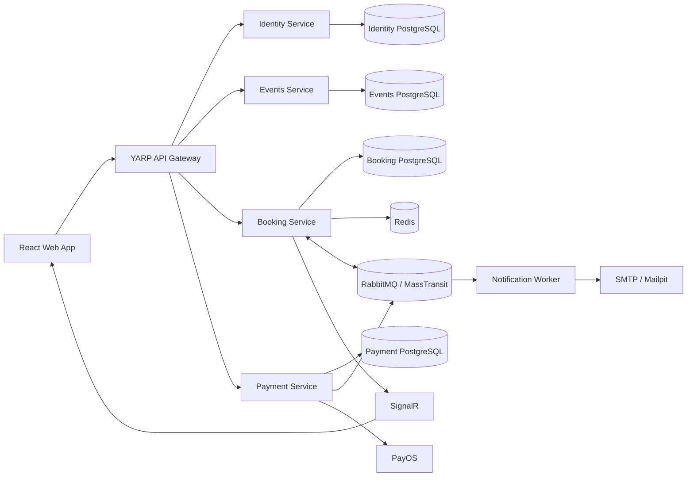

# FlashSeat

FlashSeat is a full-stack event ticketing platform built with .NET 8, React, and a microservice architecture. Customers can browse published events, select seats, hold them for five minutes, pay through PayOS using a VietQR/bank-transfer payment link, and receive confirmed electronic tickets. Administrators can design seat layouts, manage event lifecycles, and check in tickets.

The booking flow uses Redis distributed locks together with PostgreSQL transactions. Redis reduces concurrent contention for the same event seats, while PostgreSQL remains the source of truth and guarantees all-or-nothing inventory updates.

## Architecture


```mermaid
flowchart LR
    Browser[React Web App] --> Gateway[YARP API Gateway]

    Gateway --> Identity[Identity Service]
    Gateway --> Events[Events Service]
    Gateway --> Booking[Booking Service]
    Gateway --> Payment[Payment Service]

    Identity --> IdentityDb[(Identity PostgreSQL)]
    Events --> EventsDb[(Events PostgreSQL)]
    Booking --> BookingDb[(Booking PostgreSQL)]
    Payment --> PaymentDb[(Payment PostgreSQL)]

    Booking --> Redis[(Redis)]
    Booking <--> RabbitMQ[(RabbitMQ / MassTransit)]
    Payment --> RabbitMQ
    RabbitMQ --> Notifications[Notification Worker]
    Notifications --> Mailpit[SMTP / Mailpit]

    Booking --> SignalR[SignalR]
    SignalR --> Browser
    Payment --> PayOS[PayOS]
```

Each bounded context owns its own database:

- `flashseat_identity`
- `flashseat_events`
- `flashseat_booking`
- `flashseat_payment`

### Services

| Service | Responsibility |
|---|---|
| Web | React customer and administrator interface |
| API Gateway | YARP routing, CORS, rate limiting, correlation IDs, and development Swagger aggregation |
| Identity | Registration, email verification, password login, Google login, JWTs, refresh-token rotation, revoke, and roles |
| Events | Event metadata, venues, schedules, lifecycle transitions, stage shapes, seat definitions, and layout coordinates |
| Booking | Seat availability, five-minute holds, bookings, tickets, check-in, inventory concurrency, and SignalR updates |
| Payment | PayOS payment links, VietQR data, HMAC webhook verification, idempotency, expiry, and late-payment recording |
| Notification Worker | Asynchronous booking-confirmed and booking-cancelled email processing |

### Technology

- .NET 8 and ASP.NET Core Minimal APIs
- React 18, TypeScript, React Router, and TanStack Query
- Entity Framework Core and PostgreSQL 16
- Redis 7 distributed seat locks
- RabbitMQ 4 and MassTransit with EF Core outbox support
- SignalR for live seat availability updates
- PayOS payment links and Vietnamese bank-transfer QR data
- YARP reverse proxy/API Gateway
- Docker Compose
- xUnit, FluentAssertions, Testcontainers, Vitest, and Testing Library

## Main Business Flows

### Event management

Administrators can create draft events with:

- Event information, venue, address, image, and schedule
- Sales start and sales end windows
- Proscenium, Thrust, Arena, or In-the-round stage shapes
- Seat types, sections, rows, prices, currencies, and layout coordinates

The event lifecycle supports draft, published, cancelled, ended, and soft-archived states. Only draft events can be edited. Publishing imports the seat definitions into Booking inventory before the event becomes public. Events with historical hold or booking activity cannot have their inventory changed, unpublished, or restored in ways that would invalidate sales history. Archived records are retained with `DeletedAt`; event, booking, payment, and ticket history is not physically deleted.

### Customer booking

```text
Browse published event
  -> Select seats
  -> Create five-minute seat hold
  -> Create PendingPayment booking
  -> Create PayOS payment link and VietQR
  -> PayOS webhook
  -> Confirm booking and book inventory
  -> Create usable tickets and send notification
```

A hold can be released while it is active or while it has been converted into a pending booking. Confirmed bookings and booked inventory cannot be released through the customer flow.

### Payment and late payment

Payment requests require an idempotency key. Reusing the same key and request fingerprint returns the existing payment instead of creating another payment link. PayOS webhooks are validated using the response envelope, amount/currency/payment-link checks, and HMAC-SHA256 signature verification. Duplicate webhook deliveries are deduplicated with a payment webhook receipt key.

Payment links and holds expire after the configured payment window. If money arrives after the payment window, the payment is recorded as `LATE_PAYMENT` for manual refund/reconciliation review. It does not publish payment success, confirm the booking, book the seats, or create a valid ticket. Cancelling a PayOS payment link is not the same as refunding a bank transfer that has already been accepted by the provider.

### Authentication and tickets

Identity uses short-lived JWT access tokens and hashed, rotating refresh tokens. Email verification and Google ID-token validation are supported. Confirmed bookings expose ticket QR codes. Administrators can scan or manually enter a ticket code; the Booking service uses a database row lock and rejects duplicate check-ins.

## Run Locally

### Requirements

- Docker
- Docker Compose v2

No local .NET, Node.js, PostgreSQL, Redis, or RabbitMQ installation is required when using the Compose workflow.

### 1. Create the environment file

```bash
cp deploy/.env.example deploy/.env
```

The example file contains local-development placeholders only. Fill in `PAYOS_CLIENT_ID`, `PAYOS_API_KEY`, and `PAYOS_CHECKSUM_KEY` to test real PayOS payments. Do not commit real credentials.

For Google login, set `GOOGLE_CLIENT_ID`. Email verification and booking notifications use Mailpit by default, so messages can be inspected locally without an external SMTP account.

### 2. Build and start the application

```bash
docker compose \
  --env-file deploy/.env \
  -f deploy/docker-compose.yml \
  up -d --build
```

The optional `tunnel` service requires a `TUNNEL_TOKEN` and is not needed for local development. A public HTTPS webhook endpoint is required when testing PayOS from an external environment.

### 3. Check service status

```bash
docker compose \
  --env-file deploy/.env \
  -f deploy/docker-compose.yml \
  ps
```

### Local URLs

| Component | URL |
|---|---|
| Web application | http://localhost:5173 |
| API Gateway | http://localhost:5000 |
| RabbitMQ Management | http://localhost:15672 |
| Mailpit | http://localhost:8025 |
| Redis | localhost:6379 |
| PostgreSQL | localhost:5432 |

### Demo Accounts

The Identity service seeds these verified local-development accounts:

| Role | Email | Password |
|---|---|---|
| Customer | `demo@flashseat.dev` | `Demo@123456` |
| Administrator | `admin@flashseat.dev` | `Admin@123456` |

Change or remove demo credentials before using the application outside local development.

## Development Without Docker

The frontend is located at `src/Web/flashseat-web`:

```bash
npm --prefix src/Web/flashseat-web install
npm --prefix src/Web/flashseat-web run dev -- --port 5174
```

Frontend checks:

```bash
npm --prefix src/Web/flashseat-web test -- --run
npm --prefix src/Web/flashseat-web run build
```

Backend tests are in `tests/FlashSeat.UnitTests`:

```bash
dotnet test tests/FlashSeat.UnitTests/FlashSeat.UnitTests.csproj
```

Some integration tests use Testcontainers and require access to a running Docker daemon. Domain and unit tests do not require that integration-test infrastructure.

## View Logs

```bash
docker compose \
  --env-file deploy/.env \
  -f deploy/docker-compose.yml \
  logs -f
```

View logs for selected services:

```bash
docker compose \
  --env-file deploy/.env \
  -f deploy/docker-compose.yml \
  logs -f gateway identity-api events-api booking-api payment-api notification-worker
```

## Stop the Application

Stop and remove containers while preserving PostgreSQL, Redis, and RabbitMQ data:

```bash
docker compose \
  --env-file deploy/.env \
  -f deploy/docker-compose.yml \
  down
```

`docker compose down -v` removes the local data volumes, including users, events, bookings, payments, tickets, Redis state, and RabbitMQ state. Use it only when intentionally resetting the entire local environment.

## License

[MIT](LICENSE)
