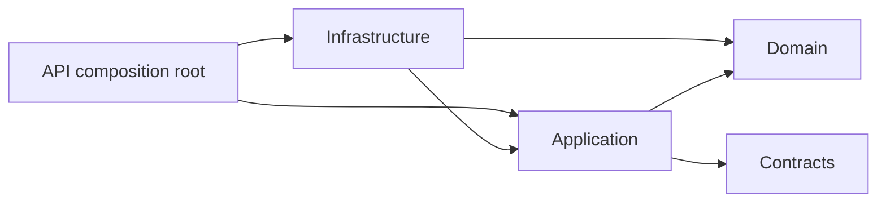
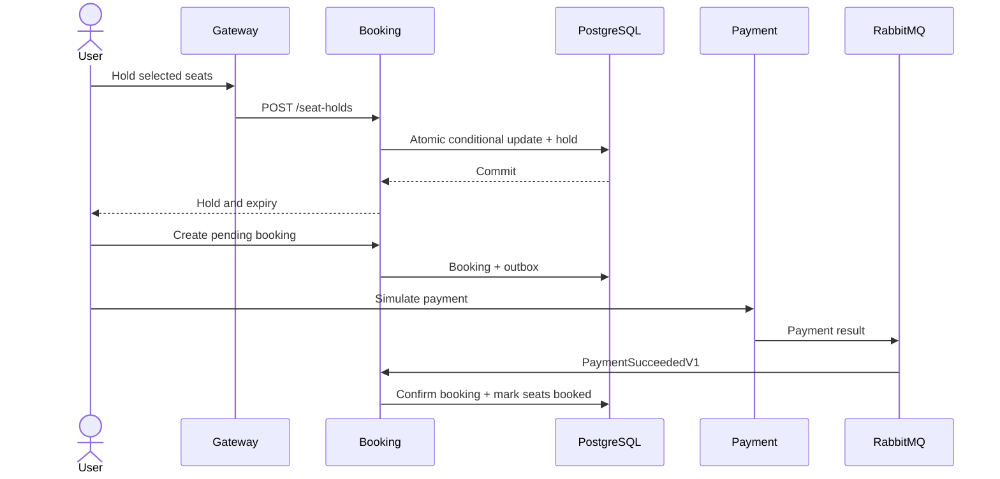

# Architecture

## Context

FlashSeat is a portfolio system for demonstrating a reliable ticket-booking flow. The browser reaches backend services only through a YARP gateway.

## Service boundaries

| Component | Owns |
|---|---|
| Identity | Users, password hashes, roles, refresh tokens, JWT issuance |
| Events | Event metadata, publishing, static seats and prices |
| Booking | Dynamic seat inventory, holds, bookings, realtime availability |
| Payment | Idempotent simulated payment attempts and results |
| Notification Worker | Bounded asynchronous notification processing |
| Gateway | Routing, correlation, CORS, headers and rate limiting only |

Domain and Application projects never depend on Infrastructure. API projects are composition roots. EF Core is used directly; no generic repository wrapper.

## Data ownership

Local development shares one PostgreSQL server for cost and convenience. Each service uses a distinct database and credentials where practical. Cross-service changes use immutable integration events, never direct database queries.

## Consistency

- Seat acquisition: short Redis locks plus an atomic PostgreSQL conditional update.
- Business event publishing: transactional outbox.
- Message delivery: at-least-once.
- Message consumption: inbox or unique constraints.
- Browser updates: SignalR hints plus HTTP refetch as recovery.

Detailed race handling belongs in `docs/concurrency.md` during Booking Phase 3.

## Dependency direction

## Runtime sequence

