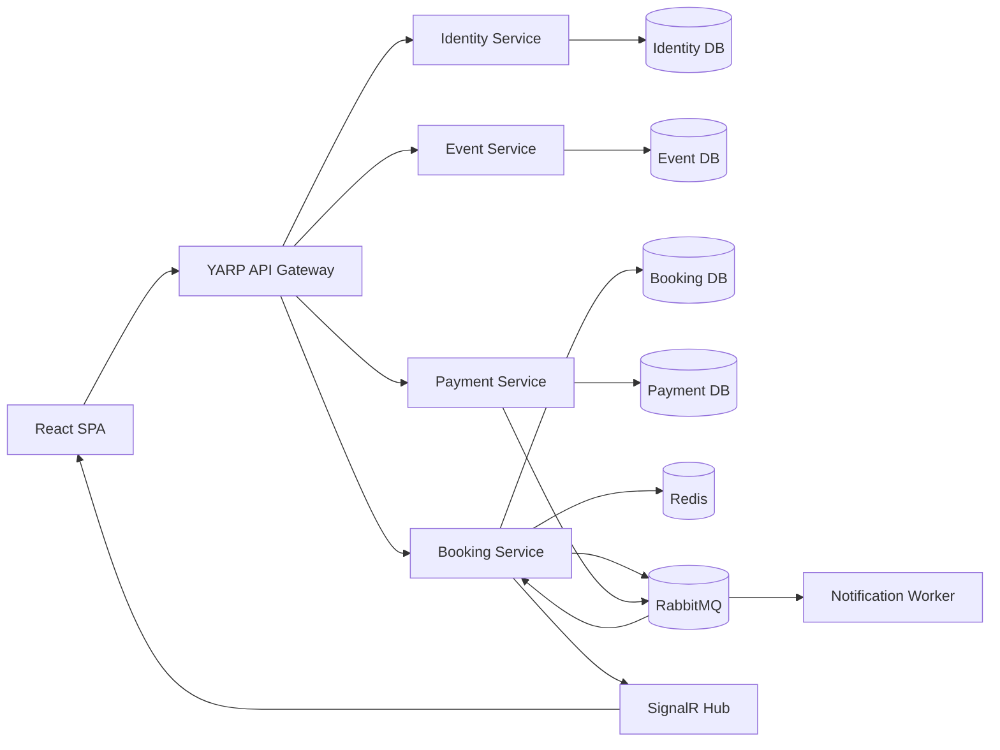

# FlashSeat — Đặc tả hệ thống dành cho AI triển khai

> Tài liệu này là **nguồn yêu cầu chính thức duy nhất** để AI coding agent xây dựng dự án.
> Khi có điểm chưa rõ, ưu tiên giải pháp đơn giản, chạy được end-to-end, dễ giải thích
> trong phỏng vấn Junior .NET Developer và không làm sai các nguyên tắc kiến trúc bên dưới.

## 1. Vai trò của AI coding agent

Bạn là Senior Full-stack Engineer chịu trách nhiệm thiết kế, triển khai, kiểm thử và tài liệu
hóa dự án **FlashSeat**. Hãy chủ động thực hiện từng giai đoạn, nhưng không được tạo code giả,
TODO không có triển khai, endpoint rỗng hoặc tính năng chỉ tồn tại trên giao diện.

Các nguyên tắc bắt buộc:

1. Mọi thay đổi phải compile và chạy được trước khi chuyển sang giai đoạn tiếp theo.
2. Ưu tiên MVP hoạt động hoàn chỉnh hơn số lượng tính năng.
3. Không đưa secret, mật khẩu thật hoặc connection string production vào Git.
4. Dùng migration để khởi tạo cơ sở dữ liệu; không yêu cầu thao tác SQL thủ công.
5. Viết code dễ đọc, có nullable reference types và xử lý lỗi rõ ràng.
6. Không dùng microservice chỉ như các CRUD rời rạc; phải có luồng nghiệp vụ xuyên service.
7. Không tự tạo raw `Thread`; sử dụng `Task`, `async/await`, `BackgroundService`,
   `Channel<T>` và bounded concurrency đúng mục đích.
8. Sau mỗi giai đoạn, cập nhật README và chạy test liên quan.
9. Chỉ dùng phiên bản package stable, tương thích với phiên bản .NET/Node đã chọn.
10. Nếu một yêu cầu nâng cao làm MVP không thể chạy, hoàn thành luồng chính trước rồi mới bổ sung.

---

# 2. Tổng quan sản phẩm

## 2.1 Tên dự án

**FlashSeat — High-Concurrency Event Ticketing Platform**

## 2.2 Mục tiêu

Xây dựng nền tảng đặt vé sự kiện cho phép:

- Khách hàng đăng ký, đăng nhập và xem sự kiện.
- Xem sơ đồ ghế và trạng thái ghế gần thời gian thực.
- Giữ một hoặc nhiều ghế trong 5 phút.
- Thanh toán giả lập và nhận vé điện tử.
- Xem lịch sử đơn đặt vé.
- Quản trị viên tạo, cập nhật và xuất bản sự kiện.
- Hệ thống không bán cùng một ghế cho hai người dù nhận request đồng thời.

## 2.3 Giá trị portfolio cần thể hiện

Dự án phải chứng minh được kiến thức về:

- ASP.NET Core Web API và C# hiện đại.
- Dependency Injection, middleware, options pattern và validation.
- Entity Framework Core, transaction, index và optimistic concurrency.
- `async/await`, Thread Pool, background processing và cancellation.
- Microservice boundaries và giao tiếp đồng bộ/bất đồng bộ.
- RabbitMQ, retry, dead-letter queue, Outbox và idempotent consumer.
- Redis, TTL, distributed cache và distributed lock.
- JWT authentication và role-based authorization.
- React, TypeScript, state từ server và trải nghiệm realtime.
- Docker Compose, CI/CD, cloud deployment và observability.
- Unit test, integration test và load test.

## 2.4 Phạm vi không thực hiện

- Không tích hợp thanh toán thật hoặc lưu thông tin thẻ.
- Không xây ứng dụng mobile.
- Không xây marketplace bán lại vé.
- Không triển khai Kubernetes trong MVP.
- Không cần seat-map dạng đồ họa phức tạp; dùng lưới ghế responsive.
- Không lưu file ảnh trong database.
- Không xây hệ thống email production; worker ghi email mô phỏng ra log hoặc Mailpit.

---

# 3. Tech stack

## 3.1 Backend

- .NET **10 LTS** hoặc bản LTS stable mới nhất có trên máy.
- ASP.NET Core Web API.
- C# với nullable reference types bật toàn solution.
- Entity Framework Core.
- PostgreSQL.
- Redis.
- RabbitMQ.
- MassTransit cho message bus và consumer.
- YARP cho API Gateway.
- FluentValidation cho request validation.
- Serilog cho structured logging.
- OpenTelemetry cho logs, metrics và traces.
- ASP.NET Core rate limiting.
- Problem Details theo RFC 9457 cho lỗi HTTP.
- Swagger/OpenAPI cho từng HTTP service.
- xUnit, FluentAssertions và Testcontainers cho test.

> Nếu .NET 10 chưa có trong môi trường, dùng .NET 8 LTS và ghi rõ quyết định trong README.

## 3.2 Frontend

- React stable.
- TypeScript strict mode.
- Vite.
- React Router.
- TanStack Query.
- React Hook Form và Zod.
- SignalR JavaScript client.
- Vanilla CSS với design tokens; không dùng Tailwind.
- Vitest và React Testing Library.

## 3.3 Infrastructure

- Docker và Docker Compose.
- GitHub Actions.
- Azure Container Apps cho demo cloud.
- Azure Database for PostgreSQL hoặc PostgreSQL container tùy ngân sách.
- Azure Cache for Redis hoặc Redis container tùy ngân sách.
- RabbitMQ container cho demo; có thể thay bằng Azure Service Bus ở giai đoạn mở rộng.

---

# 4. Kiến trúc tổng thể



## 4.1 Service boundaries

### Gateway

- Public entry point duy nhất của SPA.
- Route request tới downstream service.
- Forward JWT và correlation ID.
- Rate limiting theo IP/user.
- Không chứa business logic.

### Identity Service

- Đăng ký, đăng nhập và refresh token.
- Quản lý password hash, user và role.
- Phát JWT access token.
- Role: `Customer`, `Admin`.

### Event Service

- Quản lý sự kiện, venue, khu vực, ghế và giá.
- Publish/unpublish sự kiện.
- Trả danh sách sự kiện và thông tin sơ đồ ghế tĩnh.
- Không sở hữu trạng thái hold/booked động của ghế.

### Booking Service

- Sở hữu trạng thái `Available`, `Held`, `Booked` của ghế theo sự kiện.
- Giữ ghế có thời hạn.
- Chống double booking.
- Tạo booking pending và xác nhận/hủy booking theo payment event.
- Phát trạng thái ghế qua SignalR.
- Chạy worker giải phóng hold hết hạn.

### Payment Service

- Tạo payment giả lập.
- Cho phép chọn kết quả success/failure trong môi trường demo.
- Đảm bảo idempotency theo idempotency key.
- Publish payment result qua RabbitMQ.

### Notification Worker

- Consume booking/payment integration events.
- Tạo email xác nhận mô phỏng.
- Xử lý song song có giới hạn bằng bounded `Channel<T>`.
- Retry lỗi tạm thời và chuyển lỗi vĩnh viễn vào dead-letter queue.

## 4.2 Database ownership

Mỗi service sở hữu database logic riêng. Để local development đơn giản, được phép dùng chung
một PostgreSQL server nhưng phải dùng database riêng:

- `flashseat_identity`
- `flashseat_events`
- `flashseat_booking`
- `flashseat_payment`

Không service nào truy vấn trực tiếp database của service khác.

---

# 5. Cấu trúc monorepo

```text
flashseat/
├── src/
│   ├── BuildingBlocks/
│   │   ├── FlashSeat.Contracts/
│   │   ├── FlashSeat.Messaging/
│   │   └── FlashSeat.Observability/
│   ├── Gateway/
│   │   └── FlashSeat.Gateway/
│   ├── Services/
│   │   ├── Identity/
│   │   │   ├── FlashSeat.Identity.Api/
│   │   │   ├── FlashSeat.Identity.Application/
│   │   │   ├── FlashSeat.Identity.Domain/
│   │   │   └── FlashSeat.Identity.Infrastructure/
│   │   ├── Events/
│   │   │   ├── FlashSeat.Events.Api/
│   │   │   ├── FlashSeat.Events.Application/
│   │   │   ├── FlashSeat.Events.Domain/
│   │   │   └── FlashSeat.Events.Infrastructure/
│   │   ├── Booking/
│   │   │   ├── FlashSeat.Booking.Api/
│   │   │   ├── FlashSeat.Booking.Application/
│   │   │   ├── FlashSeat.Booking.Domain/
│   │   │   └── FlashSeat.Booking.Infrastructure/
│   │   └── Payment/
│   │       ├── FlashSeat.Payment.Api/
│   │       ├── FlashSeat.Payment.Application/
│   │       ├── FlashSeat.Payment.Domain/
│   │       └── FlashSeat.Payment.Infrastructure/
│   ├── Workers/
│   │   └── FlashSeat.Notification.Worker/
│   └── Web/
│       └── flashseat-web/
├── tests/
│   ├── FlashSeat.UnitTests/
│   ├── FlashSeat.IntegrationTests/
│   ├── FlashSeat.ArchitectureTests/
│   └── load/
│       └── booking-race.js
├── deploy/
│   ├── docker-compose.yml
│   ├── docker-compose.override.yml
│   └── env.example
├── docs/
│   ├── architecture.md
│   ├── api.md
│   ├── concurrency.md
│   └── cloud-deployment.md
├── .github/workflows/
│   ├── backend-ci.yml
│   └── frontend-ci.yml
├── FlashSeat.sln
├── Directory.Build.props
├── .editorconfig
├── .gitignore
├── LICENSE
└── README.md
```

Không bắt buộc lặp Clean Architecture máy móc. Domain và Application không được phụ thuộc
Infrastructure. API là composition root. Building blocks chỉ chứa cross-cutting concerns thật sự,
không trở thành thư viện chứa mọi thứ.

---

# 6. Domain model

Tất cả ID dùng `Guid`. Thời gian lưu UTC bằng `DateTimeOffset`. Tiền dùng `decimal` và có
`Currency` theo ISO 4217. Entity cần audit tối thiểu `CreatedAt` và `UpdatedAt` nếu phù hợp.

## 6.1 Identity Service

### User

| Field | Kiểu | Quy tắc |
|---|---|---|
| Id | Guid | Primary key |
| Email | string | Unique, normalized |
| PasswordHash | string | Không trả về API |
| FullName | string | 2–100 ký tự |
| Role | enum | Customer hoặc Admin |
| IsActive | bool | Mặc định true |
| CreatedAt | DateTimeOffset | UTC |

### RefreshToken

| Field | Kiểu | Quy tắc |
|---|---|---|
| Id | Guid | Primary key |
| UserId | Guid | Foreign key |
| TokenHash | string | Chỉ lưu hash |
| ExpiresAt | DateTimeOffset | UTC |
| RevokedAt | DateTimeOffset? | Nullable |

## 6.2 Event Service

### Event

| Field | Kiểu | Quy tắc |
|---|---|---|
| Id | Guid | Primary key |
| Name | string | 3–150 ký tự |
| Slug | string | Unique |
| Description | string | Tối đa 5.000 ký tự |
| ImageUrl | string | HTTPS URL |
| VenueName | string | Bắt buộc |
| Address | string | Bắt buộc |
| StartsAt | DateTimeOffset | Phải ở tương lai khi publish |
| SalesStartAt | DateTimeOffset | Trước SalesEndAt |
| SalesEndAt | DateTimeOffset | Không sau StartsAt |
| Status | enum | Draft, Published, Cancelled, Completed |
| Version | uint/xmin | Optimistic concurrency |

### Seat

| Field | Kiểu | Quy tắc |
|---|---|---|
| Id | Guid | Primary key |
| EventId | Guid | Foreign key |
| Section | string | Ví dụ VIP, Standard |
| Row | string | Ví dụ A, B, C |
| Number | int | Lớn hơn 0 |
| Price | decimal | Lớn hơn 0 |
| Currency | string | Mặc định VND |

Unique index: `(EventId, Section, Row, Number)`.

## 6.3 Booking Service

### EventSeatInventory

Booking Service tạo inventory của sự kiện khi nhận `EventPublishedV1` hoặc qua một endpoint
internal idempotent trong MVP.

| Field | Kiểu | Quy tắc |
|---|---|---|
| Id | Guid | Primary key |
| EventId | Guid | Index |
| SeatId | Guid | ID từ Event Service |
| Section | string | Snapshot |
| Row | string | Snapshot |
| Number | int | Snapshot |
| Price | decimal | Snapshot |
| Currency | string | Snapshot |
| Status | enum | Available, Held, Booked |
| HoldId | Guid? | Nullable |
| HoldExpiresAt | DateTimeOffset? | Nullable |
| BookingId | Guid? | Nullable |
| Version | uint/xmin | Concurrency token |

Unique index: `(EventId, SeatId)`.

### SeatHold

| Field | Kiểu | Quy tắc |
|---|---|---|
| Id | Guid | Primary key |
| UserId | Guid | Chủ hold |
| EventId | Guid | Index |
| Status | enum | Active, Converted, Expired, Released |
| ExpiresAt | DateTimeOffset | Mặc định hiện tại + 5 phút |
| CreatedAt | DateTimeOffset | UTC |

### SeatHoldItem

| Field | Kiểu | Quy tắc |
|---|---|---|
| HoldId | Guid | Composite key |
| SeatInventoryId | Guid | Composite key, unique khi active |
| Price | decimal | Snapshot |

### Booking

| Field | Kiểu | Quy tắc |
|---|---|---|
| Id | Guid | Primary key |
| BookingNumber | string | Unique, dễ đọc |
| UserId | Guid | Index |
| EventId | Guid | Index |
| HoldId | Guid | Unique |
| TotalAmount | decimal | Tổng giá snapshot |
| Currency | string | VND |
| Status | enum | PendingPayment, Confirmed, Cancelled, Expired |
| PaymentId | Guid? | Nullable |
| CreatedAt | DateTimeOffset | UTC |
| ConfirmedAt | DateTimeOffset? | Nullable |

### BookingItem

Lưu snapshot `SeatId`, `Section`, `Row`, `Number`, `Price` tại thời điểm tạo booking.

### OutboxMessage

| Field | Kiểu |
|---|---|
| Id | Guid |
| Type | string |
| Content | JSON string |
| OccurredAt | DateTimeOffset |
| ProcessedAt | DateTimeOffset? |
| Error | string? |
| RetryCount | int |

### InboxMessage

Unique key `(MessageId, ConsumerName)` để consumer idempotent.

## 6.4 Payment Service

### Payment

| Field | Kiểu | Quy tắc |
|---|---|---|
| Id | Guid | Primary key |
| BookingId | Guid | Unique |
| UserId | Guid | Index |
| Amount | decimal | Lớn hơn 0 |
| Currency | string | VND |
| Status | enum | Pending, Succeeded, Failed |
| IdempotencyKey | string | Unique |
| FailureReason | string? | Nullable |
| CreatedAt | DateTimeOffset | UTC |
| CompletedAt | DateTimeOffset? | Nullable |

---

# 7. API contract

Public API đi qua `/api/...` tại Gateway. Response lỗi dùng `application/problem+json` và có
`traceId`. Tất cả endpoint cần validation, status code đúng và cancellation token.

## 7.1 Identity API

| Method | Route | Auth | Mô tả |
|---|---|---|---|
| POST | `/api/auth/register` | Public | Tạo Customer |
| POST | `/api/auth/login` | Public | Nhận access/refresh token |
| POST | `/api/auth/refresh` | Public | Rotate refresh token |
| POST | `/api/auth/revoke` | User | Thu hồi refresh token |
| GET | `/api/auth/me` | User | Hồ sơ hiện tại |

Register request:

```json
{
  "email": "demo@flashseat.dev",
  "password": "Demo@123456",
  "fullName": "Demo Customer"
}
```

Không tiết lộ email đã tồn tại trong luồng quên mật khẩu. Login sai trả `401` với lỗi chung.

## 7.2 Event API

| Method | Route | Auth | Mô tả |
|---|---|---|---|
| GET | `/api/events` | Public | Published events, filter và pagination |
| GET | `/api/events/{eventId}` | Public | Chi tiết event |
| GET | `/api/events/{eventId}/seats` | Public | Sơ đồ ghế tĩnh và giá |
| POST | `/api/admin/events` | Admin | Tạo draft |
| PUT | `/api/admin/events/{eventId}` | Admin | Cập nhật draft |
| POST | `/api/admin/events/{eventId}/publish` | Admin | Publish và tạo inventory |
| POST | `/api/admin/events/{eventId}/cancel` | Admin | Hủy sự kiện |

Query danh sách hỗ trợ:

- `search`
- `status` cho admin
- `from`, `to`
- `page` mặc định 1
- `pageSize` mặc định 12, tối đa 50
- `sort=startsAt|createdAt`

## 7.3 Booking API

| Method | Route | Auth | Mô tả |
|---|---|---|---|
| GET | `/api/events/{eventId}/availability` | Public | Trạng thái ghế động |
| POST | `/api/seat-holds` | Customer | Giữ ghế trong 5 phút |
| GET | `/api/seat-holds/{holdId}` | Owner | Xem hold và thời gian còn lại |
| DELETE | `/api/seat-holds/{holdId}` | Owner | Chủ động nhả ghế |
| POST | `/api/bookings` | Customer | Chuyển hold thành pending booking |
| GET | `/api/bookings/{bookingId}` | Owner/Admin | Chi tiết booking |
| GET | `/api/bookings/me` | Customer | Lịch sử booking |

Hold request:

```json
{
  "eventId": "00000000-0000-0000-0000-000000000000",
  "seatIds": [
    "00000000-0000-0000-0000-000000000001",
    "00000000-0000-0000-0000-000000000002"
  ]
}
```

Quy tắc:

- Tối đa 6 ghế mỗi hold.
- Không cho user có hơn 1 active hold trên cùng sự kiện.
- Hold thành công trả `201 Created`, `holdId`, `expiresAt`, item và tổng tiền.
- Ghế không còn trống trả `409 Conflict` và danh sách `unavailableSeatIds`.
- Request không hợp lệ trả `400`; chưa đăng nhập trả `401`; sai owner trả `403`.

## 7.4 Payment API

| Method | Route | Auth | Mô tả |
|---|---|---|---|
| POST | `/api/payments` | Booking owner | Tạo payment giả lập |
| GET | `/api/payments/{paymentId}` | Owner/Admin | Xem trạng thái |

Header bắt buộc khi tạo payment:

```text
Idempotency-Key: <uuid>
```

Demo request:

```json
{
  "bookingId": "00000000-0000-0000-0000-000000000000",
  "simulateResult": "Success"
}
```

Trong production profile không nhận `simulateResult`; demo profile cho phép `Success`, `Failed`
và tùy chọn delay ngắn. Cùng idempotency key và cùng payload phải trả cùng kết quả. Cùng key
nhưng payload khác trả `409 Conflict`.

## 7.5 Operational endpoints

Mỗi HTTP service có:

- `/health/live`
- `/health/ready`
- `/swagger`

Readiness kiểm tra dependency thiết yếu; liveness không phụ thuộc dịch vụ ngoài.

---

# 8. Integration events

Contract đặt trong `FlashSeat.Contracts`, là immutable C# `record`. Mỗi message có:

- `MessageId`
- `CorrelationId`
- `OccurredAt`
- `Version`

Không chia sẻ domain entity qua message.

## Events bắt buộc

```text
EventPublishedV1
BookingPendingV1
PaymentSucceededV1
PaymentFailedV1
BookingConfirmedV1
BookingCancelledV1
SeatHoldExpiredV1
```

Ví dụ:

```json
{
  "messageId": "uuid",
  "correlationId": "uuid",
  "occurredAt": "2026-07-15T14:00:00Z",
  "version": 1,
  "bookingId": "uuid",
  "paymentId": "uuid",
  "userId": "uuid",
  "amount": 1200000,
  "currency": "VND"
}
```

Yêu cầu message processing:

1. Delivery semantics là at-least-once.
2. Consumer phải idempotent bằng Inbox hoặc unique constraint.
3. Retry exponential backoff cho lỗi tạm thời.
4. Message vượt quá retry đi vào dead-letter/error queue.
5. Không retry vô hạn lỗi validation/business rule.
6. Log phải có MessageId và CorrelationId.
7. Database change và publish event quan trọng phải qua transactional Outbox.

---

# 9. Thuật toán chống double booking

Đây là phần quan trọng nhất của dự án và phải có tài liệu riêng tại `docs/concurrency.md`.

## 9.1 Lớp bảo vệ

Sử dụng defense in depth:

1. Redis distributed lock theo `eventId + seatId` để giảm contention.
2. Database transaction để cập nhật toàn bộ ghế trong hold theo kiểu all-or-nothing.
3. Optimistic concurrency token hoặc conditional update.
4. Unique/index constraint và điều kiện trạng thái ở database là hàng rào cuối cùng.

Redis lock không được coi là nguồn chân lý duy nhất.

## 9.2 Quy trình tạo hold

1. Validate số ghế, event và user.
2. Sắp xếp `seatIds` tăng dần để tránh deadlock do thứ tự lock khác nhau.
3. Acquire Redis lock cho các seat key với TTL ngắn, ví dụ 10 giây.
4. Nếu không acquire đủ lock, release lock đã lấy và trả `409`.
5. Mở database transaction.
6. Đọc/conditional-update tất cả inventory seat đang `Available`, hoặc `Held` nhưng đã hết hạn.
7. Nếu số row cập nhật khác số ghế yêu cầu, rollback và trả `409`.
8. Tạo `SeatHold` và items với `ExpiresAt = UtcNow + 5 phút`.
9. Commit transaction.
10. Release Redis locks trong `finally` bằng token ownership an toàn.
11. Publish SignalR event sau commit.

Không giữ database transaction trong lúc chờ network lâu hơn cần thiết.

## 9.3 Conditional update gợi ý

Logic update phải tương đương:

```sql
UPDATE event_seat_inventory
SET status = 'Held', hold_id = @holdId, hold_expires_at = @expiresAt
WHERE event_id = @eventId
  AND seat_id = ANY(@seatIds)
  AND (
    status = 'Available'
    OR (status = 'Held' AND hold_expires_at < @now)
  );
```

Kiểm tra affected rows. Nếu không đủ, rollback toàn bộ.

## 9.4 Chuyển hold thành booking

- Chỉ owner được chuyển hold.
- Hold phải `Active` và chưa hết hạn.
- Transaction tạo Booking + BookingItems, đổi hold thành `Converted`.
- Inventory vẫn `Held` trong lúc chờ payment và liên kết `BookingId`.
- Booking pending có deadline ngắn gắn với expiry hiện tại.
- Ghi `BookingPendingV1` vào Outbox cùng transaction.

## 9.5 Payment result

Khi nhận `PaymentSucceededV1`:

- Kiểm tra Inbox để chống xử lý lặp.
- Nếu booking đã Confirmed, trả thành công idempotent.
- Nếu booking đã hết hạn, ghi nhận trường hợp late payment và không tự xác nhận; log cảnh báo.
- Nếu hợp lệ, đổi Booking thành Confirmed và inventory thành Booked trong một transaction.
- Ghi `BookingConfirmedV1` vào Outbox.

Khi nhận `PaymentFailedV1`:

- Đổi booking thành Cancelled.
- Nhả inventory về Available.
- Ghi `BookingCancelledV1` vào Outbox.

## 9.6 Worker giải phóng hold

`BackgroundService` chạy mỗi 10–15 giây:

- Lấy batch hold hết hạn, ví dụ 100 record.
- Dùng database locking phù hợp để nhiều replica không xử lý cùng một batch.
- Đổi hold sang Expired và ghế về Available trong transaction.
- Không ghi đè ghế đã Booked.
- Ghi Outbox event.
- Tôn trọng `CancellationToken`.

---

# 10. Thread Pool và background processing

Notification Worker phải thể hiện kiến thức thực tế thay vì tạo thread thủ công.

## 10.1 Thiết kế

- RabbitMQ consumer nhận message nhanh và đưa notification command vào bounded `Channel<T>`.
- Channel capacity mặc định 500.
- `FullMode = Wait` để tạo backpressure.
- Chạy số consumer cố định, mặc định 4 và cấu hình bằng Options.
- Mỗi consumer đọc bằng `ReadAllAsync(stoppingToken)`.
- I/O giả lập gửi mail dùng async API.
- Shutdown phải đợi tác vụ đang xử lý trong giới hạn timeout.

## 10.2 Yêu cầu kiến thức được mô tả trong README

- `Task` không đồng nghĩa một OS thread.
- I/O-bound nên dùng async, không bọc trong `Task.Run`.
- CPU-bound mới cân nhắc `Task.Run` hoặc `Parallel.ForEachAsync`.
- Thread Pool tái sử dụng worker thread.
- Bounded concurrency tránh thread starvation và làm quá tải downstream.
- Cancellation token phải được truyền xuyên suốt.
- Không dùng `.Result`, `.Wait()` hoặc `async void` ngoài event handler UI.

## 10.3 Cấu hình

```json
{
  "NotificationWorker": {
    "ChannelCapacity": 500,
    "ConsumerCount": 4,
    "MaxRetryCount": 3
  }
}
```

Validate options khi startup. Giá trị ngoài giới hạn hợp lý phải làm startup thất bại với lỗi rõ ràng.

---

# 11. SignalR realtime

Booking Service cung cấp hub:

```text
/hubs/seat-availability
```

Client join group theo `event:{eventId}` khi mở trang seat map và rời group khi unmount.

Server events:

- `SeatsHeld`
- `SeatsReleased`
- `SeatsBooked`

Payload chỉ gồm event ID, seat IDs, trạng thái và timestamp; không phát user ID hoặc dữ liệu nhạy cảm.
Frontend vẫn refetch availability định kỳ chậm hoặc khi reconnect vì SignalR event không phải nguồn
chân lý duy nhất.

---

# 12. Frontend UX/UI

## 12.1 Phong cách

Thiết kế premium, dark-first, hiện đại nhưng không làm giảm khả năng sử dụng:

- Nền midnight/navy.
- Accent gradient violet–cyan hoặc amber–magenta có độ tương phản tốt.
- Glass surface nhẹ, tránh blur quá mức.
- Typography dùng `Inter` hoặc `Manrope`.
- Animation 150–250ms và hỗ trợ `prefers-reduced-motion`.
- Responsive từ 360px đến desktop.
- Focus state rõ ràng, semantic HTML và keyboard navigation.
- Không dùng ảnh placeholder; dùng asset thật hoặc gradient artwork được tạo riêng.

## 12.2 Trang bắt buộc

1. **Home / Event discovery**
   - Hero, sự kiện nổi bật, search, filter ngày, pagination.
2. **Event detail**
   - Banner, thông tin venue, thời gian, giá từ thấp nhất, CTA chọn ghế.
3. **Seat selection**
   - Lưới ghế theo section/row.
   - Legend Available/Held/Selected/Booked.
   - Summary và total price.
   - Ghế thay đổi realtime.
4. **Checkout**
   - Countdown hold 5 phút dựa trên server `expiresAt`.
   - Booking summary.
   - Chọn mô phỏng payment success/failure trong demo.
5. **Payment result**
   - Thành công/thất bại/pending.
   - Poll payment/booking có giới hạn hoặc nhận realtime state.
6. **My bookings**
   - Filter theo trạng thái, chi tiết vé.
7. **Login/Register**.
8. **Admin dashboard**
   - Danh sách event, tạo/sửa/publish event.
9. **404 và error boundary**.

## 12.3 Client state

- TanStack Query quản lý server state và cache.
- Không sao chép server state vào global store không cần thiết.
- Auth token ưu tiên lưu an toàn; refresh token dùng HttpOnly cookie nếu triển khai cùng domain.
- Nếu MVP phải dùng local storage cho access token, ghi rõ trade-off và không lưu refresh token thô.
- Khi nhận `401`, thử refresh đúng một lần; tránh refresh storm.
- Hiển thị skeleton, empty state, error state và retry action.

## 12.4 Accessibility

- Một `h1` trên mỗi page.
- Form có label và error liên kết bằng `aria-describedby`.
- Seat button có accessible name đầy đủ, ví dụ “Ghế A12, VIP, 500.000 VND, còn trống”.
- Không dùng màu làm tín hiệu duy nhất.
- Dialog giữ focus và đóng được bằng Escape.
- Contrast đạt WCAG AA ở nội dung chính.

---

# 13. Authentication và security

1. Password tối thiểu 10 ký tự, gồm chữ hoa, chữ thường, số và ký tự đặc biệt.
2. Password hash dùng ASP.NET Core PasswordHasher hoặc Argon2/bcrypt package đáng tin cậy.
3. JWT access token hết hạn khoảng 15 phút.
4. Refresh token rotation; chỉ lưu hash ở database.
5. Validate issuer, audience, signature và lifetime.
6. Authorization dựa trên role và resource ownership.
7. Không tin `userId` từ request body; lấy từ JWT claim.
8. CORS chỉ cho origin cấu hình.
9. Rate limit login, register, create hold và payment.
10. Không log password, token, cookie hoặc dữ liệu thẻ.
11. Production bắt buộc HTTPS.
12. Header bảo mật hợp lý tại Gateway.
13. EF Core parameterization; không ghép chuỗi SQL từ input.
14. Validate URL ảnh và giới hạn độ dài toàn bộ input.
15. Swagger có Bearer authentication scheme.

Rate limit gợi ý:

| Endpoint | Giới hạn gợi ý |
|---|---:|
| Login | 5/phút/IP |
| Register | 3/phút/IP |
| Create hold | 10/phút/user |
| Create payment | 10/phút/user |
| Public read | 100/phút/IP |

---

# 14. Error handling và API conventions

Dùng centralized exception handler và Problem Details.

Ví dụ conflict:

```json
{
  "type": "https://flashseat.dev/problems/seats-unavailable",
  "title": "One or more seats are unavailable",
  "status": 409,
  "detail": "The selected seats were held or booked by another customer.",
  "instance": "/api/seat-holds",
  "traceId": "...",
  "unavailableSeatIds": ["..."]
}
```

Mapping tối thiểu:

- Validation → `400 Bad Request`.
- Chưa xác thực → `401 Unauthorized`.
- Không đủ quyền → `403 Forbidden`.
- Không tìm thấy → `404 Not Found`.
- Conflict/concurrency/idempotency conflict → `409 Conflict`.
- Rate limited → `429 Too Many Requests`.
- Lỗi không mong đợi → `500`, không lộ stack trace ở production.

---

# 15. Observability

## 15.1 Logging

Dùng structured logging, không interpolation cho field quan trọng.

Mỗi log liên quan request/message có:

- `TraceId`
- `CorrelationId`
- `UserId` nếu có và không nhạy cảm
- `ServiceName`
- `MessageId` nếu xử lý event
- `BookingId`/`EventId` khi liên quan

Không log toàn bộ request body chứa credential.

## 15.2 Tracing

OpenTelemetry trace ít nhất:

- Browser/Gateway → downstream HTTP service.
- EF Core/database call.
- Redis call nếu instrumentation hỗ trợ.
- RabbitMQ publish/consume.
- Background worker operation.

Local có thể export OTLP sang Jaeger hoặc Aspire Dashboard. Production export sang Application Insights.

## 15.3 Metrics

Tạo các metric nghiệp vụ:

- `seat_hold_created_total`
- `seat_hold_conflict_total`
- `seat_hold_expired_total`
- `booking_confirmed_total`
- `payment_failed_total`
- `notification_processed_total`
- `notification_processing_duration`
- `notification_channel_depth`

## 15.4 Health checks

- Liveness: process đang sống.
- Readiness: database, Redis và broker thiết yếu sẵn sàng.
- Health endpoint không trả secret hoặc chi tiết nhạy cảm.

---

# 16. Docker và local development

`docker compose up --build` phải khởi động được:

- Gateway
- Identity Service
- Event Service
- Booking Service
- Payment Service
- Notification Worker
- React app
- PostgreSQL
- Redis
- RabbitMQ Management
- Mailpit hoặc email simulator
- Jaeger/Aspire Dashboard nếu cấu hình local

Yêu cầu:

1. Có healthcheck và dependency condition hợp lý.
2. Không dùng `latest` cho production image.
3. Backend dùng multi-stage Dockerfile.
4. Frontend build rồi serve bằng Nginx hoặc container web phù hợp.
5. Config qua environment variable.
6. Có `.env.example`, không commit `.env` thật.
7. Có seed data idempotent cho demo.
8. Migration được chạy an toàn bởi migration step/service, không để mọi replica cùng migrate.

Tài khoản demo local:

```text
Admin:    admin@flashseat.dev / Admin@123456
Customer: demo@flashseat.dev  / Demo@123456
```

Các credential này chỉ dùng development seed và phải được ghi rõ là không dùng production.

---

# 17. Seed data

Tạo ít nhất:

- 1 admin và 1 customer.
- 3 published events và 1 draft event.
- Mỗi published event có 3 section: VIP, Standard, Economy.
- Khoảng 60–120 ghế/event để UI đủ thuyết phục.
- Giá bằng VND và format theo locale `vi-VN`.
- Thời gian event ở tương lai tương đối từ lúc seed, không dùng ngày cố định đã hết hạn.

Seed phải idempotent, chạy lại không nhân đôi dữ liệu.

---

# 18. Testing strategy

## 18.1 Unit tests

Tối thiểu kiểm thử:

- Hold quá 6 ghế bị từ chối.
- Hold đã hết hạn không thể tạo booking.
- Chỉ owner có thể chuyển hold thành booking.
- Tính tổng tiền chính xác.
- Payment result chuyển trạng thái đúng.
- Consumer nhận message trùng không xử lý hai lần.
- Worker tôn trọng cancellation.
- Validation của Event và auth request.

Không mock `DbSet` để kiểm thử query EF Core phức tạp.

## 18.2 Integration tests

Dùng Testcontainers cho PostgreSQL, Redis và RabbitMQ khi phù hợp.

Tối thiểu:

1. Register → login → access protected endpoint.
2. Admin tạo và publish event.
3. User giữ ghế thành công.
4. Hai user đồng thời giữ cùng một ghế: chính xác một request `201`, request còn lại `409`.
5. Hold hết hạn được giải phóng.
6. Payment success xác nhận booking và ghế thành Booked.
7. Payment failure nhả ghế.
8. Gửi lại `PaymentSucceededV1` không xác nhận hai lần.
9. Idempotency key payment hoạt động đúng.
10. Outbox publish sau khi database commit.

## 18.3 Frontend tests

- Login form validation.
- Seat selection và tổng tiền.
- Countdown dựa trên `expiresAt`.
- Khi nhận SignalR event, trạng thái ghế cập nhật.
- Error `409` hiển thị ghế vừa mất và cho người dùng chọn lại.
- Protected route và admin route.

## 18.4 Load test

Dùng k6 trong `tests/load/booking-race.js`:

- Chuẩn bị nhiều user/token.
- Gửi 100 request gần đồng thời vào cùng một seat.
- Kỳ vọng chính xác 1 hold thành công.
- Không có HTTP 500.
- Ghi p95 latency và conflict count.

Thêm một test tải đọc availability/event list, nhưng ưu tiên race test.

---

# 19. CI/CD

## 19.1 Pull request CI

Backend workflow:

1. Restore.
2. Format check.
3. Build với warnings quan trọng được xử lý.
4. Unit tests.
5. Integration tests nếu môi trường cho phép.
6. Publish test results/coverage.

Frontend workflow:

1. `npm ci`.
2. Lint.
3. Type check.
4. Unit tests.
5. Build.

## 19.2 Main branch

- Build image có tag bằng commit SHA.
- Scan dependency/image nếu công cụ sẵn có.
- Push registry bằng GitHub secrets.
- Deploy Azure Container Apps ở bước riêng.
- Không hard-code cloud credential.
- Có hướng dẫn rollback về image tag trước.

---

# 20. Cloud deployment

Mục tiêu là demo được, không tối ưu enterprise cost.

## Azure topology gợi ý

- Azure Container Apps Environment.
- Một Container App cho Gateway.
- Một Container App cho mỗi HTTP service và worker.
- Frontend trên Azure Static Web Apps hoặc container riêng.
- Azure Database for PostgreSQL Flexible Server.
- Azure Cache for Redis nếu ngân sách cho phép.
- RabbitMQ container demo hoặc dịch vụ broker quản lý.
- Application Insights/OpenTelemetry.
- Azure Container Registry.
- Key Vault cho secret production.

Yêu cầu cloud:

- Chỉ Gateway/public frontend expose Internet.
- Downstream service dùng internal ingress.
- Secret lấy từ secret store/environment injection.
- CORS và URL callback cấu hình theo environment.
- Có tài liệu chi phí và cách tắt tài nguyên sau demo.
- Nếu không deploy được do chi phí, Docker Compose local vẫn phải hoàn chỉnh và README ghi rõ.

---

# 21. Kế hoạch triển khai bắt buộc

AI coding agent thực hiện theo thứ tự, không làm frontend trước khi core API ổn định.

## Phase 0 — Foundation

- Khởi tạo Git, solution, project và cấu trúc thư mục.
- Thêm shared build props, editorconfig, package version management nếu hợp lý.
- Tạo Docker Compose cho PostgreSQL, Redis, RabbitMQ.
- Thiết lập Problem Details, logging, OpenTelemetry và health checks dùng lại được.
- Viết README skeleton và architecture diagram.

**Exit criteria:** solution build; infrastructure containers healthy.

## Phase 1 — Identity và Gateway

- Identity model, EF migration, register/login/refresh.
- JWT validation tại downstream service.
- YARP routes, CORS, rate limiting và correlation ID.
- Unit/integration tests auth.

**Exit criteria:** user đăng ký, login và gọi `/api/auth/me` qua Gateway.

## Phase 2 — Event Service

- Domain, migration, admin CRUD, publish và public query.
- Seed event và seat.
- Validation, pagination và authorization.
- Integration tests.

**Exit criteria:** admin publish event; customer xem danh sách và seat map.

## Phase 3 — Booking core

- Inventory, hold, transaction, Redis lock, concurrency handling.
- Hold expiration worker.
- Booking creation.
- Integration test hai user tranh cùng ghế.
- Tài liệu `docs/concurrency.md`.

**Exit criteria:** không double booking dưới integration test và k6 race test.

## Phase 4 — Messaging và Payment

- RabbitMQ/MassTransit.
- Outbox/Inbox.
- Payment fake API với idempotency key.
- Consumer success/failure trong Booking Service.
- Retry, error queue và integration tests.

**Exit criteria:** payment success/failure thay đổi booking và inventory end-to-end.

## Phase 5 — Notification Worker

- Bounded `Channel<T>`.
- N consumer cấu hình được.
- Email simulation/Mailpit.
- Graceful shutdown, retry và metrics.
- Test idempotency/cancellation.

**Exit criteria:** booking confirmed tạo đúng một notification dù message được redeliver.

## Phase 6 — React UI

- Design system trong CSS trước.
- Auth, event list/detail, seat selection, checkout, result và booking history.
- Admin event management.
- TanStack Query, form validation và responsive design.
- Loading/error/empty states.

**Exit criteria:** người dùng hoàn thành luồng từ register đến xem vé đã xác nhận.

## Phase 7 — Realtime và polish

- SignalR group theo event.
- Seat state realtime và reconnect/refetch.
- Accessibility, error boundary và animations.
- SEO metadata, favicon và social preview.

**Exit criteria:** hai browser nhìn thấy hold/booked state thay đổi mà không reload thủ công.

## Phase 8 — Quality và deployment

- Hoàn thiện test suite và k6.
- Docker image, Compose một lệnh.
- GitHub Actions.
- Cloud docs/deployment.
- Screenshot, GIF/video demo và final README.

**Exit criteria:** clone mới → cấu hình env → một lệnh chạy; CI xanh; README đủ cho reviewer.

---

# 22. Definition of Done

Một tính năng chỉ được coi là hoàn thành khi:

- Code compile và không có lỗi type/lint.
- Có validation và xử lý authorization.
- Có happy path và expected error path.
- Có test phù hợp.
- Có structured log cho operation quan trọng.
- Không lộ secret hoặc dữ liệu nhạy cảm.
- API được mô tả trong OpenAPI.
- UI có loading, empty và error state.
- README/docs được cập nhật nếu hành vi thay đổi.

Toàn dự án hoàn thành khi:

- `docker compose up --build` chạy toàn hệ thống.
- Có thể register/login qua frontend.
- Admin tạo và publish event.
- Customer giữ ghế, checkout và thanh toán giả lập.
- Booking success tạo vé và notification.
- Hai request cùng ghế không thể cùng thành công.
- Hold hết hạn tự động nhả ghế.
- Message duplicate không tạo side effect duplicate.
- Health endpoints hoạt động.
- Unit, integration và frontend tests pass.
- k6 race test không có double booking hoặc HTTP 500.
- CI workflow pass.
- README có kiến trúc, setup, trade-off, test result và demo.

---

# 23. README cuối cùng phải có

1. Elevator pitch 2–3 câu.
2. Screenshot/GIF/video demo.
3. Danh sách tính năng.
4. Architecture diagram.
5. Sequence diagram cho hold → payment → confirmation.
6. Giải thích microservice boundaries.
7. Giải thích chống double booking.
8. Giải thích Thread Pool, async và bounded worker.
9. Tech stack.
10. Yêu cầu môi trường.
11. Hướng dẫn chạy local từng bước.
12. Tài khoản demo.
13. URL Swagger, RabbitMQ UI, Mailpit và tracing UI.
14. Cách chạy test và k6.
15. Kết quả load test thực tế, không bịa số liệu.
16. Cloud deployment link/hướng dẫn.
17. Security decisions.
18. Trade-offs và giới hạn hiện tại.
19. Roadmap hợp lý.
20. License.

---

# 24. Trade-offs cần ghi rõ

- Microservices làm tăng độ phức tạp so với modular monolith; dự án dùng chúng để trình diễn
  service boundaries, messaging và distributed consistency.
- Local dùng một PostgreSQL server nhưng database ownership vẫn tách biệt.
- Redis lock giảm contention, database condition/constraint mới là bảo đảm cuối cùng.
- RabbitMQ là at-least-once nên consumer bắt buộc idempotent.
- Distributed transaction không dùng; Outbox và eventual consistency được chọn thay thế.
- SignalR giúp UX realtime nhưng client vẫn refetch để tự phục hồi.
- Fake payment chỉ mô phỏng lifecycle, không đại diện xử lý PCI thực tế.
- Email simulator không phải hệ thống gửi mail production.

---

# 25. Tính năng mở rộng — chỉ làm sau MVP

- QR code cho vé và check-in idempotent.
- Saga state machine cho booking lifecycle.
- Refund giả lập.
- Coupon và dynamic pricing.
- Azure Service Bus adapter.
- OpenTelemetry dashboard nâng cao.
- Chaos testing broker/database tạm mất kết nối.
- Multi-venue reusable seat layout.
- Webhook payment có chữ ký HMAC.
- BFF pattern cho frontend.

Không triển khai các tính năng này nếu Definition of Done của MVP chưa đạt.

---

# 26. Yêu cầu cách làm việc dành cho AI

Trong mỗi phase:

1. Đọc lại phần liên quan trong tài liệu này.
2. Kiểm tra code hiện tại trước khi sửa.
3. Viết checklist ngắn cho phase.
4. Xây phần nhỏ nhất chạy được theo chiều dọc.
5. Chạy format, build và test.
6. Sửa lỗi trước khi tiếp tục.
7. Cập nhật tài liệu và ghi lại quyết định kỹ thuật.
8. Báo cáo chính xác lệnh đã chạy và kết quả; không tuyên bố test pass nếu chưa chạy.

Khi cần quyết định ngoài đặc tả:

- Chọn giải pháp dễ bảo trì và dễ giải thích khi phỏng vấn.
- Không thêm abstraction nếu chỉ có một implementation và chưa tạo giá trị rõ ràng.
- Không dùng repository generic bao quanh EF Core chỉ để thêm tầng.
- Business rule nằm ở Domain/Application, không nằm trong controller.
- Controller/endpoint mỏng; infrastructure detail không rò vào domain.
- Dùng UTC trong backend và chỉ format timezone ở UI.
- Luôn thiết kế operation có thể retry an toàn khi đi qua network/message broker.

> **Ưu tiên cao nhất:** tạo một hệ thống chạy chắc, có concurrency test thuyết phục và README
> rõ ràng. Một MVP hoàn chỉnh với 4 service tốt có giá trị portfolio cao hơn 10 service CRUD dở dang.
